# UNIT-HACK\_NAUMEN - "Организатор в кармане"

## 📄 Описание проекта

Универсальный Telegram-бот, который выполняет функции карманного организатора для участников и организаторов мероприятий.
Он помогает:

* Управлять личным расписанием;
* Записываться на мастер-классы;
* Получать уведомления;
* Общаться с администрацией;
* А также управлять мероприятиями со стороны организаторов.

---

## 🌐 Ключевые возможности

### ✅ Для участников:

* **Личный кабинет** с индивидуальным расписанием
* **Запись на мастер-классы**:

  * Список доступных мастер-классов с полной информацией
  * Автоматическое обновление слотов в реальном времени
* **Лист ожидания**:

  * Автоматическая очередь при отсутствии мест
  * Уведомления о появлении мест
* **Уведомления и напоминания**:

  * О начале сессий и изменениях
* **QR-Code**:

  * Генерация и просмотр QR-кода для входа
* **Интерактив**:

  * Вопросы спикерам
  * Общение с администраторами
* **FAQ**: Быстрые ответы на частые вопросы
## Приветствие и регистрация
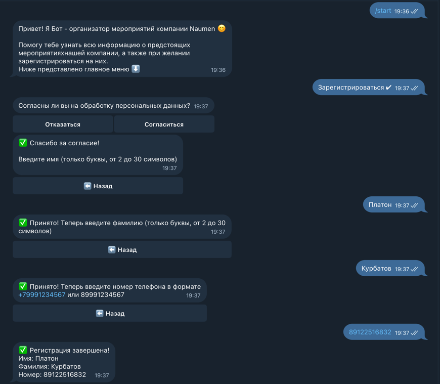

## Актуальные события и регистрация на них
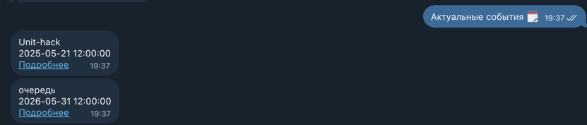
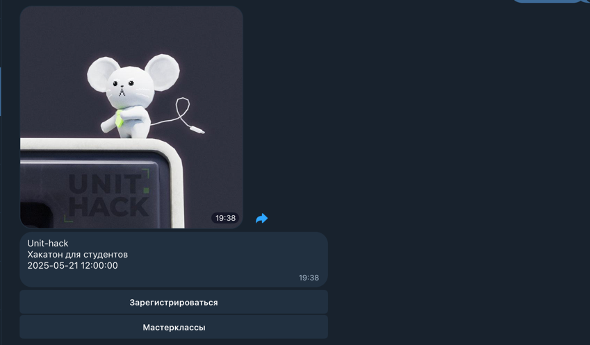
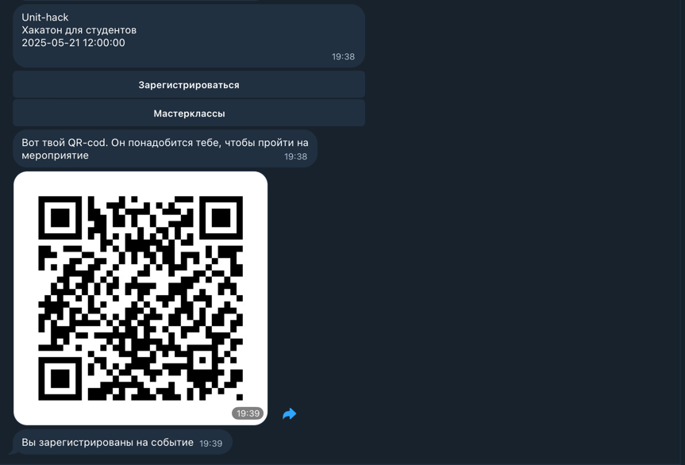

## Профиль пользователя и вопросы огранизаторам
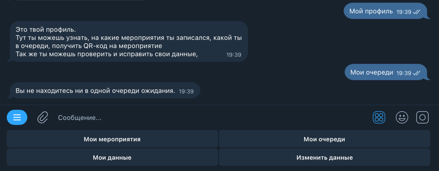
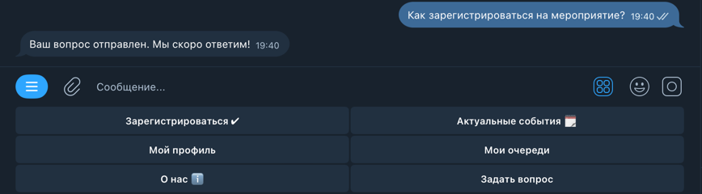

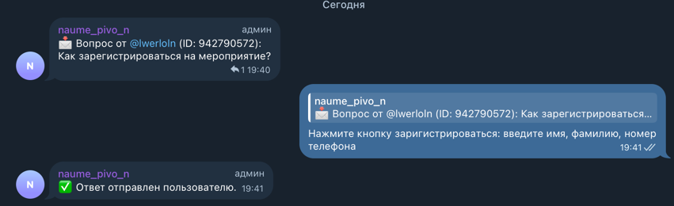

## Уведомление о новых событиях


## FAQ
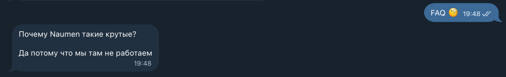

### 👩‍💻 Для организаторов:

* **Панель управления**:

  * Публикация новостей и обновлений
  * Push-уведомления
* **Управление мастер-классами**:

  * Создание и редактирование
  * Установка лимитов
  * Просмотр списков участников
* **Чат администраторов**:

  * Ответы участникам
  * Внутреннее общение

## Приветствие
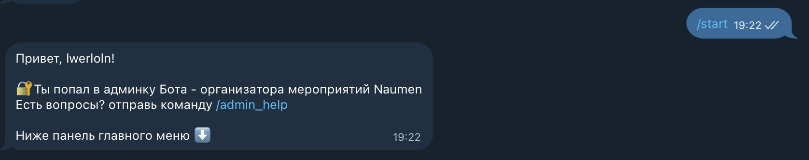

## Добавление нового события и рассылка участникам
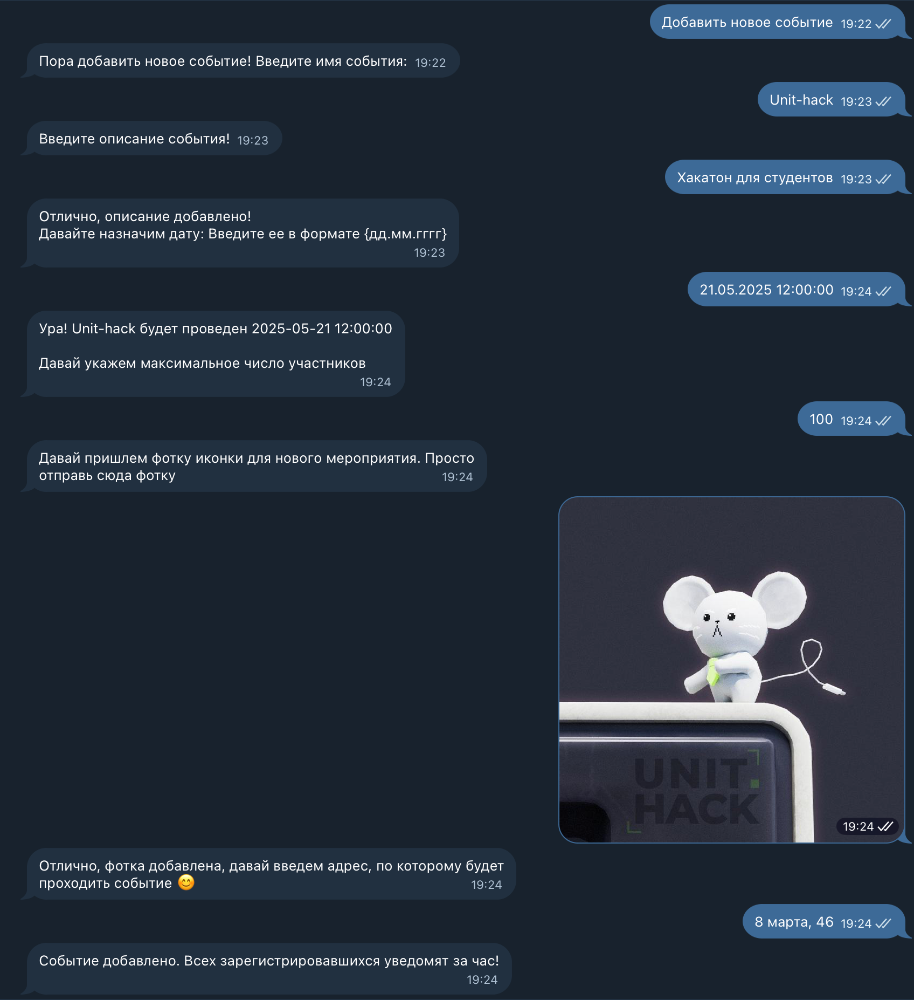
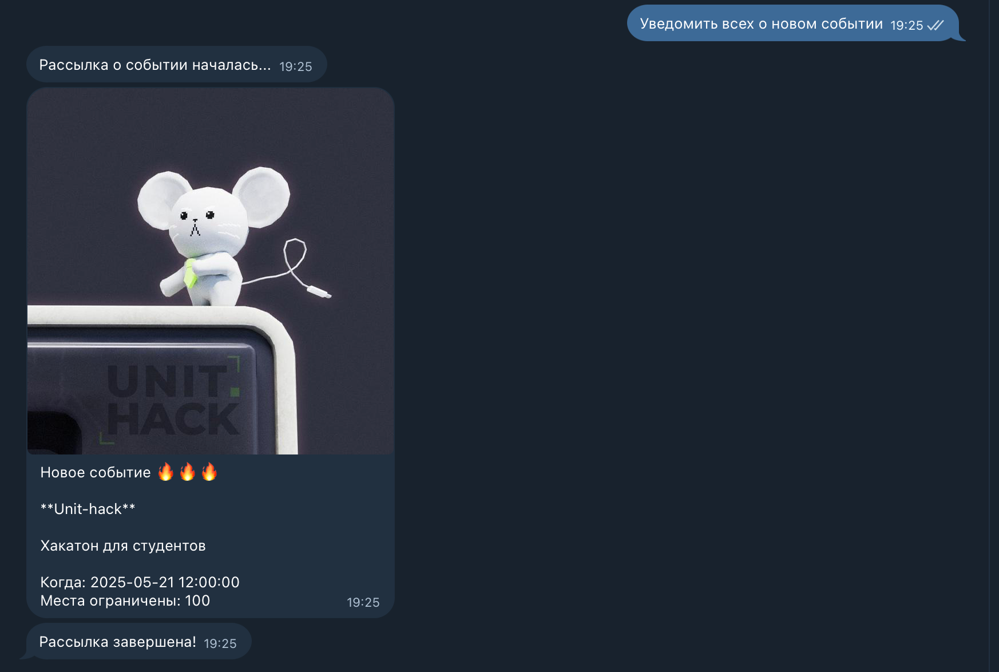

## Создание FAQ
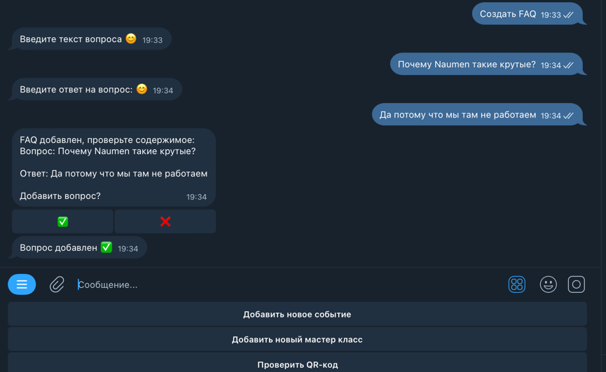

## Рассылка объявлений участникам
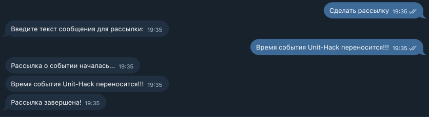

---

## 💻 Технологический стек

* **Язык:** Python 3.13
* **База данных:** PostgreSQL
* **Асинхронные библиотеки:**

  * Aiogram — Telegram Bot API
  * asyncpg — PostgreSQL драйвер
* **ORM:** SQLAlchemy
* **Работа с датой/временем:** datetime
* **Генерация и чтение QR:**

  * qrcode, Pillow, pyzbar
* **UUID:** для уникальных идентификаторов

---

## 🚀 Установка и запуск проекта

### 📅 Предварительные требования:

* Python 3.10+
* Git
* PostgreSQL
* Poetry (рекомендуется)

---

### 🔽 Клонирование репозитория

```bash
git clone https://github.com/profitist/unit-hack_naumen.git
cd unit-hack_naumen
```

---

### 🚁 Настройка окружения

#### ✅ Вариант 1: c использованием Poetry

```bash
poetry install
poetry shell
```

#### ✅ Вариант 2: с использованием venv

```bash
python -m venv venv
source venv/bin/activate        # Linux/macOS
venv\Scripts\activate          # Windows
pip install -r requirements.txt
```

---

### 🔢 Настройка базы данных

1. Установите PostgreSQL
2. Создайте базу данных и пользователя
3. Добавьте параметры подключения в `.env` файл:

```
DB_HOST=localhost
DB_PORT=5432
DB_NAME=your_db
DB_USER=your_user
DB_PASS=your_password
```

---

### 🛠️ Применение миграций (если используется Alembic)

```bash
alembic upgrade head
```

---

### 🔄 Запуск бота

```bash
python main.py
```

---

## ✨ Авторы

Проект разработан на хакатоне UNIT-HACK командой beer_log
